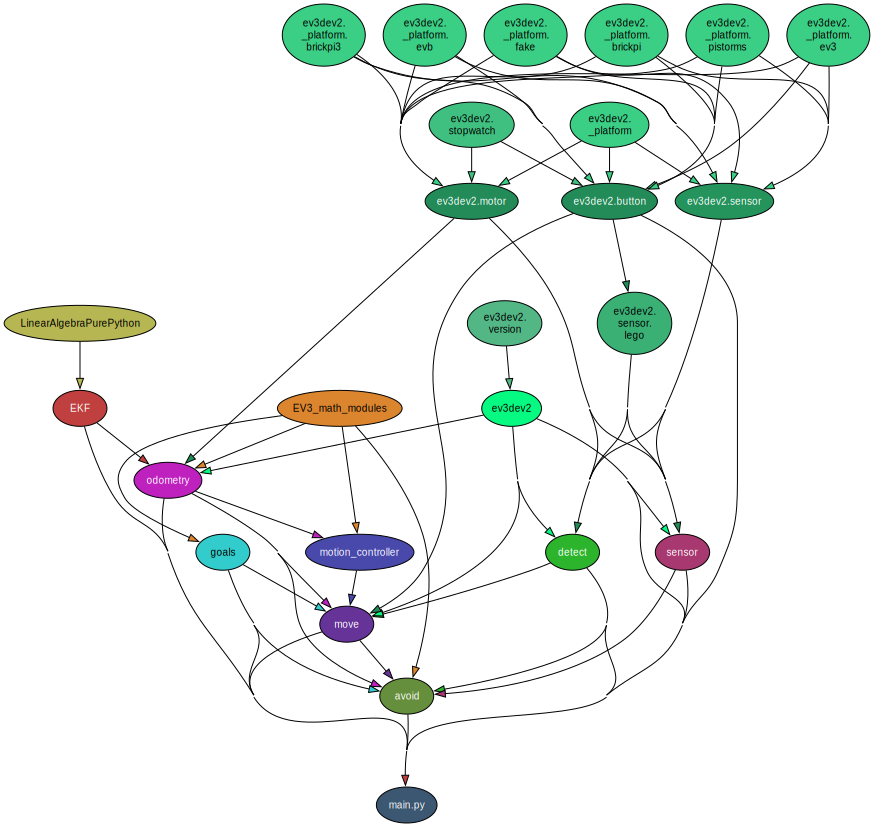
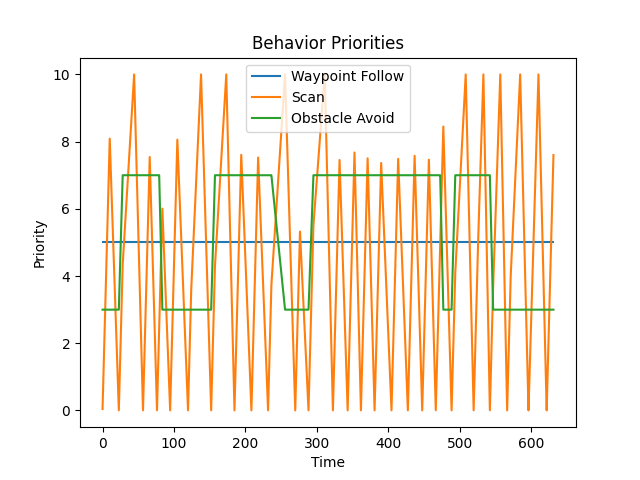
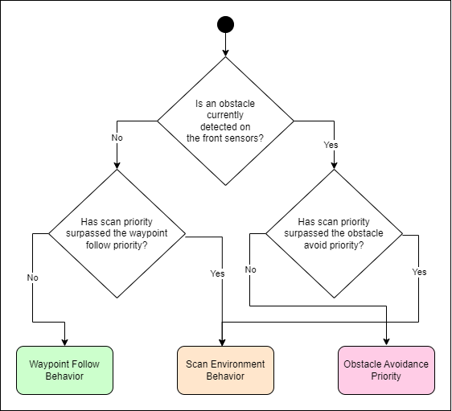
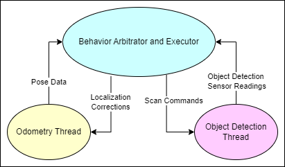
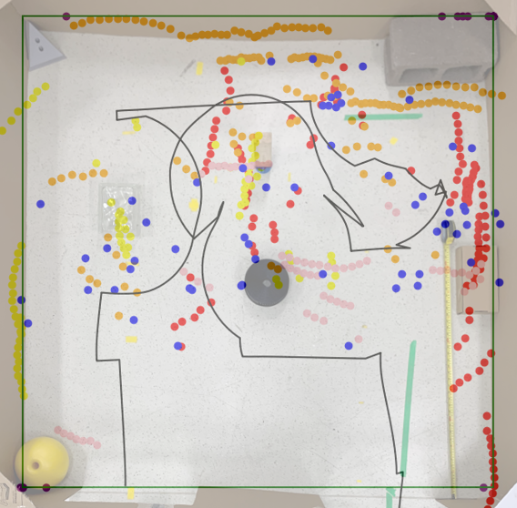
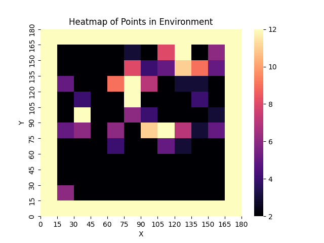

# Gerard-Robot

Design project for MECH6905

Project involved mapping a known environment with an unknown number of obstacles distributed randomly.


Mapping of a known environment with an unknown number of obstacles distributed randomly represents a very different problem from simply an unknown environment. When the space is well defined, qualities such as the shape and size of each room can be used to localize an exploring robot even while encountering features that it has never observed before. The main challenge in this localization is data association, how can what is known be associated with sensor readings. This paper will present a novel robotic architecture that combines behavior arbitration, an Extended Kalman Filter (EKF), bug-style obstacle avoidance, and feature extraction to present an agent which will be able to autonomously map a number of unknown objects in a well-defined space.

## Installation

To install the required packages, run the following command:

```bash
pip install -r requirements.txt
```

## Modules Structure

The project is started by running main.py on the EV3 robot.

The dependency graph is as follows:



## Robot Behavior Arbitration

A behavioral architecture was chosen for it's combination of reaction and deliberation along with it's ease of explanation to observers. The following figure shows a typical mapping mission of the robot through an unknown environment. The constant nature of the "Follow Waypoints" behavior, the ramp shape of the "Scan Environment" behavior, and the boolean nature of the "Avoid Obstacles" behavior can be observed.



The simplified decision tree can be seen below:



## Software Structure

The software implementation of this project was designed with a focus on modularity. Each distinct feature was contained within it's own module and project global variables were replaced with getters and setters for module scope local variables. Multithreading was used for increased reaction time and simplicity of code logic. The three seperate threads were as follows:

- **Main Thread**: Handles behavior arbitration, waypoint following, obstacle avoidance and scanning.

- **Odometry Thread**: Handles constantly updated vehicle odometry from the motor encoders. Is updated by localization corrections in the main thread.

- **Detection Thread**: Handles constantly updating from avoidance ultrasonic sensor and touch sensors, as well as front sensor scanning motion. Is controlled by scanning commands in the main thread.

This structure can be observed in the figure below:



## Results

The results of the demo run can be seen in the following plots:






It can be be observed that the robot was able to successfully detect all obstacles except for the wedge in the upper left corner.
